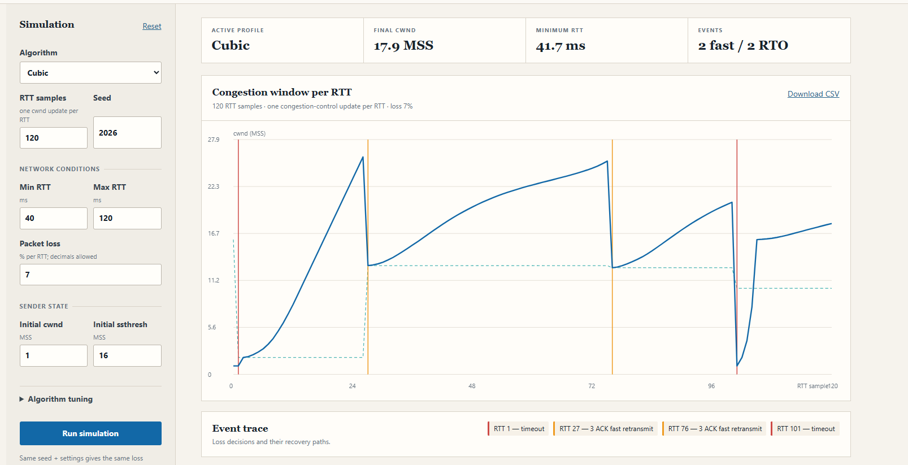
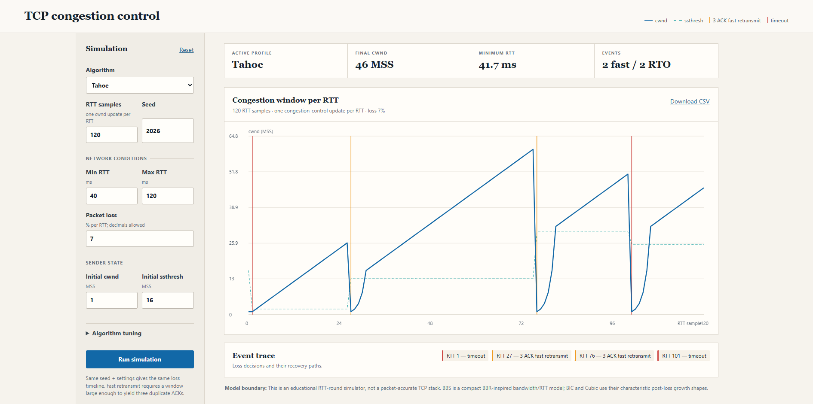
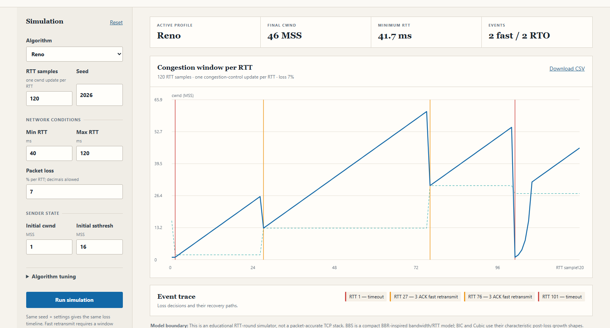
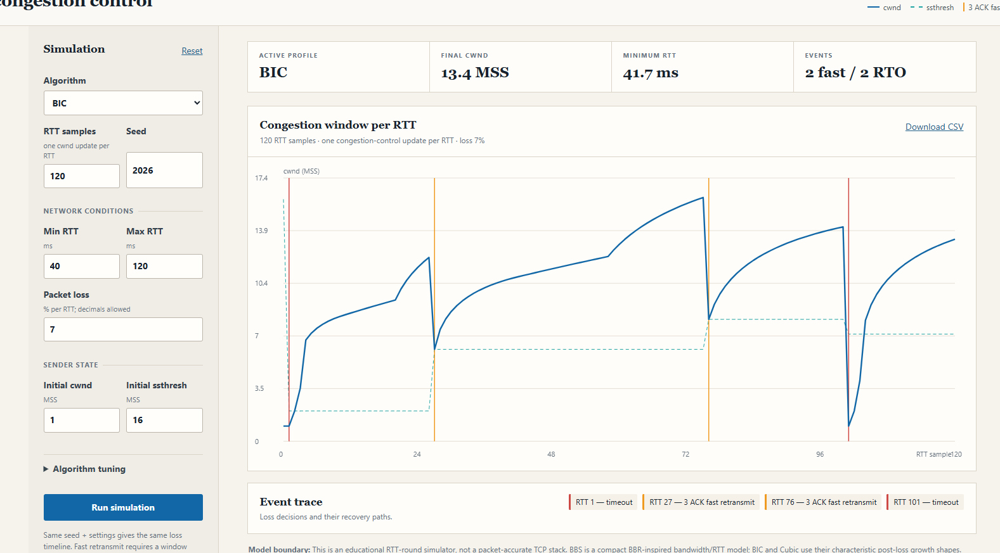

# TCP Congestion Control Visualizer

A dependency-free browser visualizer for studying how TCP congestion windows respond to acknowledgements, fast retransmits, and retransmission timeouts. Choose a controller, make loss and RTT conditions reproducible, then inspect the resulting `cwnd` and `ssthresh` trajectory one RTT at a time.

   
  A reproducible Cubic teaching-model run, including fast retransmit and timeout markers.

## What it shows

- **Six controller profiles** — Tahoe, Reno, Vegas, BIC, Cubic, and BBS, a compact BBR-inspired bandwidth/RTT controller.
- **Deterministic scenarios** — a seed reproduces the RTT and loss-decision timeline, making comparisons inspectable.
- **Readable recovery signals** — blue shows `cwnd`, dashed cyan shows `ssthresh`, amber marks three-duplicate-ACK fast retransmits, and red marks retransmission timeouts.
- **Exportable data** — download the exact per-RTT samples as CSV for further analysis.

## Using the simulator

Each x-axis position represents one simulated RTT and one congestion-control update. Windows and thresholds are expressed in MSS.

| Control | Purpose |
|---|---|
| **RTT samples** | Number of simulated RTT rounds. |
| **Seed** | Reproduces the same RTT and loss-decision sequence. |
| **Min/Max RTT** | Bounds the RTT sampled for each round. |
| **Packet loss** | Probability of a loss decision per RTT; fractional percentages are accepted. |
| **Initial cwnd / ssthresh** | Sender state at the beginning of the run. |

A loss becomes a three-duplicate-ACK event only when the simulated flight has enough later segments; otherwise it is represented as a timeout. The event trace below the chart lists each recovery path.

## Model scope

This is an educational, RTT-round model rather than a packet-accurate TCP stack. Slow start approximates one ACK per segment in a full flight, so the window doubles until `ssthresh`; Tahoe and Reno congestion avoidance then grows by roughly one MSS per RTT. The BIC and Cubic profiles emphasize their characteristic post-loss growth shapes. BBS is explicitly a compact BBR-inspired controller, not an implementation of a production BBR stack.

The test suite exercises the deterministic simulation module directly.

## Screenshots

   
  Tahoe resets the window after both displayed fast retransmit and timeout events.

   
  Reno’s RTT-round recovery trace with fast retransmits and a timeout.

   
  BIC’s target-oriented post-loss recovery in the teaching model.

## License

TCP Congestion Control Visualizer is licensed under the [MIT License](LICENSE).
